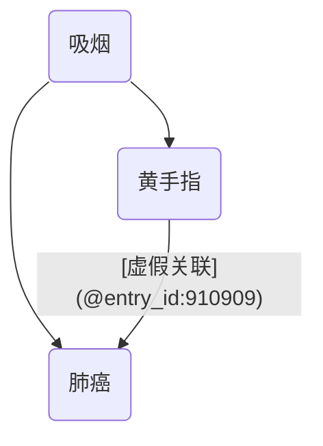
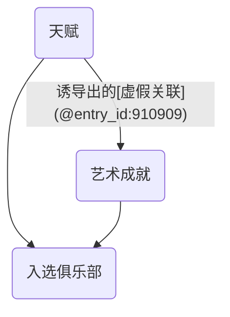

## 引言
在任何严谨的科学探索中，我们不仅要问“我们观察到了什么？”，更要追问“我们的观察可信吗？”以及“这个发现在别处也适用吗？”。这两个根本性问题构成了科学证据可信度的基石，并分别指向了两个核心概念：**[内部效度](@entry_id:916901)（Internal Validity）**与**[外部效度](@entry_id:910536)（External Validity）**。无论是评估一种新药的疗效，还是分析一项公共政策的影响，我们都必须面对一个核心挑战：如何从充满噪音和偏倚的复杂世界中分离出真实的因果效应，并判断这一效应能否推广到更广泛的人群中去。这正是本篇文章旨在解决的知识鸿沟。

为了系统地构建您对这两个概念的理解，本文将分为三个部分。在“**原理与机制**”一章中，我们将深入探讨[内部效度](@entry_id:916901)与[外部效度](@entry_id:910536)的定义，剖析混杂、[选择偏倚](@entry_id:172119)等关键威胁，并介绍[随机对照试验](@entry_id:909406)和有向无环图等核心思想工具。接着，在“**应用的交响**”一章中，我们将视野拓宽，考察这些效度原则如何在临床医学、生态学乃至人工智能等不同学科中发挥作用，展示其作为科学推理通用语言的魅力。最后，通过“**动手实践**”部分，您将有机会通过具体的计算练习来巩固这些抽象的理论。

现在，让我们首先步入效[度理论](@entry_id:636058)的殿堂，从其最基本的原理与机制开始，学习如何辨别科学研究中的真伪与适用边界。

## 原理与机制

在科学的殿堂里，我们是侦探，孜孜不倦地追寻着因果关系的蛛丝马迹。我们的研究，无论是[临床试验](@entry_id:174912)还是[观察性研究](@entry_id:906079)，都是我们用来审问自然的工具。但我们如何知道我们的审问得到了“真相”，而不是被误导的供词呢？这便是效度（Validity）问题的核心。效度分为两种：**[内部效度](@entry_id:916901)（Internal Validity）** 和 **[外部效度](@entry_id:910536)（External Validity）**。它们共同构成了我们对科学证据信心的基石。

### 精确的错误：[随机误差](@entry_id:144890)与系统误差

想象一下，你想测量一座山的高度。你有两种可能犯的错误。第一种，你的卷尺可能因为温度变化而有微小的、随机的伸缩。你测量一次，可能偏高；再测一次，可能偏低。但如果你不厌其烦地测量成千上万次再取平均值，你就会无限接近真实的高度。这种可以通过增加[样本量](@entry_id:910360)来“稀释”的误差，我们称之为**[随机误差](@entry_id:144890)（random error）**。

然而，还有一种更阴险的错误。如果你的卷尺在出厂时就被刻错了，比如它上面的“1米”实际上是1.1米。那么，无论你多么虔诚地测量成千上万次，你得到的答案都将系统性地偏高10%。你得到的可能是一个非常*精确*的数字——比如，精确到毫米——但它却是一个*错误*的数字。这种无法通过增加[样本量](@entry_id:910360)来消除的、源于测量工具或研究设计本身缺陷的恒定偏差，就是**系统误差（systematic error）**，也就是我们常说的**偏倚（bias）**。

在[流行病学](@entry_id:141409)研究中，增加研究的[样本量](@entry_id:910360)（$n$）就像多次测量山高。它能减少随机误差，让我们估计的效应值（比如[风险比](@entry_id:173429)）周围的置信区间变得更窄，也就是结果更“精确”。但是，如果研究设计本身存在系统误差——那把“刻错的卷尺”——那么再大的[样本量](@entry_id:910360)也只会让我们以更高的精度，更自信地得出一个错误的结论。一个巨大的研究可能会得出一个置信区间极窄的偏倚结果，这对于科学真理而言，可能比一个小[样本量](@entry_id:910360)、结果不确定的研究更加危险。因此，一项研究的灵魂拷问便是：我们的“卷尺”是准的吗？这个问题，就是[内部效度](@entry_id:916901)的核心。

### [内部效度](@entry_id:916901)：在研究的“实验室”里寻找真相

**[内部效度](@entry_id:916901)**指的是，在我们所研究的特定人群中，我们观察到的关联在多大程度上反映了真实的因果效应。换句话说，它问的是：“我们的研究结论，对于参与我们研究的这群人来说，是正确的吗？”一个具有高[内部效度](@entry_id:916901)的研究，就像一个干净、无干扰的实验室，它成功地[隔离](@entry_id:895934)了我们想要研究的因果关系，排除了所有其他的“噪音”或“污染”。

#### 理想世界：潜能结果与[随机化](@entry_id:198186)

为了谈论“真实的”因果效应，我们需要一个思想实验的框架。想象一下，你此刻头痛，正在纠结是否要吃一片阿司匹林。现实中，你只能选择一条路：要么吃，要么不吃。你永远无法同时观察到吃了和不吃的你。但在一个由“可能性”构成的平行宇宙里，我们可以设想存在两个你：一个吃了阿司匹林（我们称她的结局为 $Y^1$），另一个没有吃（结局为 $Y^0$）。这两个结局之间的差异，$Y^1 - Y^0$，就是阿司匹林对你*个人*的真实因果效应。

这个思想实验中的 $Y^1$ 和 $Y^0$ 被称为**潜能结果（potential outcomes）**。由于我们每个人在现实中只能观测到一个潜能结果（事实上的那个），因果推断的核心难题就是要想办法估计那个我们永远无法观测到的“[反事实](@entry_id:923324)”结局。

既然无法在个体身上实现，我们便转向群体。我们想知道的是**平均[处理效应](@entry_id:636010)（Average Treatment Effect, ATE）**，即 $E[Y^1 - Y^0]$。这时，**随机化（randomization）**这根魔法棒便登场了。在一个理想的**[随机对照试验](@entry_id:909406)（Randomized Controlled Trial, R[CT](@entry_id:747638)）**中，我们像抛硬币一样，把参与者随机分配到处理组（吃阿司匹林）和对照组（不吃）。随机化的神奇之处在于，只要[样本量](@entry_id:910360)足够大，它能确保两组人在接受处理*之前*，在所有已知的和未知的特征上（年龄、性别、病情严重程度、基因……）都是统计上相似的。

如此一来，处理组就成了“假如所有人都接受处理”这个平行宇宙的绝佳代表，而对照组则代表了“假如所有人都不接受处理”的那个宇宙。两组结局的简单差异，就成了对平均[处理效应](@entry_id:636010)的一个无偏估计。

从更严谨的角度看，[内部效度](@entry_id:916901)的本质是**可识别性（identifiability）**。这意味着，我们想估计的因果量（如 $E[Y^1 - Y^0 \mid S=1]$，其中 $S=1$ 表示研究人群）能够仅从我们观测到的数据（如处理、结局、[协变](@entry_id:634097)量的联合分布）和一系列明确的假设中唯一确定。一个研究的[内部效度](@entry_id:916901)是其设计层面的属性，关乎从观测数据到因果结论的逻辑桥梁是否成立，而不仅仅是某个[统计估计量](@entry_id:170698)是否无偏。

### 真实世界的陷阱：偏倚的迷宫

然而，我们大多数时候并非身处随机化构建的理想“实验室”中，而是在充满未知与复杂的真实世界（即**[观察性研究](@entry_id:906079)**）里摸索。这里充满了可能扭曲真相的陷阱，每一种都是对[内部效度的威胁](@entry_id:893896)。我们可以借助一种强大的思维工具——**有向无环图（Directed Acyclic Graphs, DAGs）**——来描绘这些陷阱的地图。在DAG中，箭头代表因果关系。

#### 陷阱一：混杂（Confounding）——岔路口的迷惑

想象一个经典的例子：研究发现，手指被烟染黄的人（暴露 $A$）更容易得肺癌（结局 $Y$）。我们能得出结论说“黄手指致癌”吗？显然不能。因为存在一个共同的原因——吸烟（$C$）。吸烟既导致手指变黄，也导致肺癌。

在这个DAG中，$C$ 就是一个**混杂因素（confounder）**。它像一个岔路口，同时连接着暴露和结局，制造了一条从 $A$ 到 $Y$ 的“后门通路”（$A \leftarrow C \rightarrow Y$），产生了一种非因果的[虚假关联](@entry_id:910909)。

在潜能结果的语言里，混杂意味着暴露组和非暴露组在研究开始前就不可比了。吸烟者（有黄手指倾向）的潜能结局（无论他们手指是否被特意染黄，他们得肺癌的风险都更高）与不吸烟者本就不同。专业地说，就是无条件的[可交换性](@entry_id:909050)（$Y^a \perp \! \! \! \perp A$）不成立。

如何走出这个迷宫？我们需要“堵住”这条后门通路。做法就是**调整（adjustment）**或**控制（controlling for）**混杂因素$C$。这意味着，我们在比较时，要确保比较对象在$C$上是相似的，比如在吸烟者中比较黄手指和非黄手指的肺癌风险，在不吸烟者中也做同样的比较。通过在$C$的每个层内进行比较，我们就打破了$C$带来的[虚假关联](@entry_id:910909)。

为了在[观察性研究](@entry_id:906079)中获得有[内部效度](@entry_id:916901)的估计，我们需要满足三个“神圣”的假设 ：
1.  **[条件可交换性](@entry_id:896124)（Conditional Exchangeability）**: 给定一组测量到的混杂因素 $L$（比如吸烟状态），暴露 $A$ 与潜能结局 $Y^a$ 就是独立的（$Y^a \perp \! \! \! \perp A \mid L$）。通俗讲，在$L$的同一水平内（比如都是吸烟者），谁接受了暴露（谁手指是黄的）是“如同随机”的。
2.  **正性（Positivity）**: 在$L$的每个层内，都必须有人接受了处理（$A=1$），也有人没接受处理（$A=0$）。否则，比较就无从谈起。
3.  **一致性（Consistency）**: 我们观察到的结局，确实是潜能结局中与其实际所受处理相对应的那一个。即如果某人接受了处理 $A=a$，那么他的观测结局 $Y$ 就是 $Y^a$。

#### 陷阱二：[选择偏倚](@entry_id:172119)（Selection Bias）——“幸存者”的假象

[选择偏倚](@entry_id:172119)是一种更为诡谲的偏倚。它常常发生于我们选择研究对象或分析数据的方式中。想象一下，我们想研究“天赋”（$E$）与“艺术成就”（$Y$）之间的关系。如果我们只去一个“高智商艺术家俱乐部”里招募研究对象（即我们的样本被限制在 $S=1$），会发生什么？

这个俱乐部的入会标准可能是：要么智商极高，要么艺术成就斐然。在这个特殊群体里，我们可能会惊奇地发现，天赋高的人艺术成就反而平平。为什么？因为能进入这个俱乐部的人，如果天赋不高，那他必然得有极高的艺术成就来弥补；反之，如果一个人艺术成就没那么突出，那他很可能得靠极高的天赋才得以入选。在这里，入选俱乐部（$S$）这个行为本身，成为了天赋（$E$）和艺术成就（$Y$）的共同结果。

在DAG的语言里，$S$ 是一个**对撞节点（collider）**，因为它被两个箭头“撞”上（$E \rightarrow S \leftarrow Y$）。在一般人群中，$E$ 和 $Y$ 之间可能没有关联。但一旦我们**限制（conditioning on）**了分析范围在对撞节点上（只看俱乐部成员），就等于打开了 $E$ 和 $Y$ 之间的一条非因果通路，人为地制造出了关联。这就是**[对撞分层偏倚](@entry_id:904466)（collider-stratification bias）**，[选择偏倚](@entry_id:172119)的一种核心机制。 医院研究中常见的“[伯克森偏倚](@entry_id:898872)”（Berkson's bias）就是这种偏倚的典型例子。

#### 陷阱三：[信息偏倚](@entry_id:903444)（Information Bias）——失真的测量

这个陷阱回到了我们最初的卷尺比喻。如果我们的测量工具本身有问题，比如在评估暴露或结局时出现错误，就会导致**[信息偏倚](@entry_id:903444)**或**[测量误差](@entry_id:270998)（measurement error）**。

一种常见的情况是**无差异错分（nondifferential misclassification）**。这意味着测量的错误与我们关心的结局无关。例如，在一项关于饮食（暴露）与心脏病（结局）的研究中，我们通过问卷调查人们一年前的饮食习惯。很多人会记错，但他们记错的方式可能与他们后来是否得了心脏病没有关系。

这种“无偏见”的错误会带来什么后果呢？它会“污染”我们的比较组。一些真正高脂饮食的人会被错误地分到低脂组，一些真正低脂饮食的人会被分到高脂组。这种“掺水”行为，会稀释真实的效应。其结果几乎总是**偏向于零关联（bias toward the null）**。也就是说，它会让我们估计出的[风险比](@entry_id:173429)（RR）更接近1，[风险差](@entry_id:910459)（RD）更接近0。一个真实存在的强关联，可能因此看起来微弱，甚至完全消失。这同样是对[内部效度](@entry_id:916901)的严重威胁。

#### 陷阱四：干扰（Interference）——多米诺骨牌效应

经典的因果推断框架有一个隐含的假设，即**[稳定单位处理价值假设](@entry_id:904007)（Stable Unit Treatment Value Assumption, SUTVA）**。其中一部分是“无干扰”，即一个个体的处理仅仅影响其自身的结局，而不会影响他人的结局。

但在很多情境下，这个假设脆弱得不堪一击。以疫苗或口罩研究为例：我戴了口罩（处理），保护了我自己。但如果我周围的所有人都戴了口罩，即便我自己不戴，我被感染的风险也会大大降低。我的结局（是否被感染）被他人的处理状态所影响。这就是**干扰（interference）**或**[溢出](@entry_id:172355)效应（spillover effect）**。

干扰的存在会动摇我们因果推断的根基。对于一个个体，“戴口罩的效应”这个概念本身就变得模糊不清了。是跟一个没人戴口罩的世界比，还是跟一个50%的人戴口罩的世界比？这两个效应是完全不同的。当SUTVA被违背时，我们传统定义的个体因果效应可能不再明确，这给[内部效度](@entry_id:916901)带来了根本性的挑战。我们需要重新定义我们想问的因果问题，例如，区分“直接效应”和“间接（[溢出](@entry_id:172355)）效应”。

### [外部效度](@entry_id:910536)：研究结论能走出实验室吗？

好了，假设我们历尽千辛万苦，通过精妙的设计（如R[CT](@entry_id:747638)）或复杂的统计调整，克服了所有偏倚，得到了一项具有完美[内部效度](@entry_id:916901)的研究结果。我们确信，在我们研究的这群人里，这个处理确实有某个大小的效应。

下一个问题自然而然地浮现：这个结论，能推广到其他人身上吗？这就是**[外部效度](@entry_id:910536)（External Validity）**或**可推广性（generalizability）**的问题。

我们精心研发出一种神奇肥料，在加州温室的番茄上效果拔群。它在多雨的俄勒冈州田野里也会同样有效吗？答案是：不一定。

原因在于**效应[异质性](@entry_id:275678)（effect heterogeneity）**或**[效应修饰](@entry_id:899121)（effect modification）**。肥料的效果可能受到[日照](@entry_id:181918)、降雨量等因素（即**[效应修饰](@entry_id:899121)因子**）的影响。加州和俄勒冈州的气候（[效应修饰](@entry_id:899121)因子的[分布](@entry_id:182848)）截然不同。

让我们看一个具体的例子 。假设一种药物对低[风险人群](@entry_id:923030)（$Z=0$）的治疗效果（[风险差](@entry_id:910459)）是0.10，而对高[风险人群](@entry_id:923030)（$Z=1$）的效果是0.40。变量 $Z$ 就是一个[效应修饰](@entry_id:899121)因子。
-   我们的研究可能恰好在一个以低[风险人群](@entry_id:923030)为主的群体（比如80%是低风险者）中进行。计算出的平均效应是 $(0.10 \times 0.8) + (0.40 \times 0.2) = 0.16$。
-   但我们想将这个结论应用到的目标人群，可能是一个以高[风险人群](@entry_id:923030)为主的群体（比如60%是高风险者）。在那里，真实的平均效应是 $(0.10 \times 0.4) + (0.40 \times 0.6) = 0.28$。

看到了吗？我们的研究结果 $0.16$ 虽然内部有效，但对于目标人群来说，它严重低估了真实效应 $0.28$。这就是[外部效度](@entry_id:910536)的失败。

[外部效度](@entry_id:910536)还可以细分为两种 ：
-   **可推广性（Generalizability）**: 能否将研究样本的结论推广到产生该样本的更广泛的来源人群？（例如，从一个医院的试验参与者推广到该医院的所有符合条件的病人）
-   **可传输性（Transportability）**: 能否将研究结论“运输”到一个特征可能完全不同的新的人群？（例如，从美国的研究结果推广到欧洲人群）

要实现[外部效度](@entry_id:910536)，[内部效度](@entry_id:916901)是必要非充分条件。一个本身就错误（内部无效）的结论，推广到任何地方都仍然是错误的。而一个内部有效的研究，要想推广，则需要满足额外的、苛刻的条件：我们必须假定[效应修饰](@entry_id:899121)的模式在研究人群和目标人群中是相同的，并且我们需要测量并了解[效应修饰](@entry_id:899121)因子在这两个人群中的[分布](@entry_id:182848)。如果满足这些条件，我们就可以通过**标准化（standardization）**或**重加权（re-weighting）**的方法，将研究结果“校准”到目标人群的特征上，从而得到一个对目标人群有效的预测。

因此，科学探索的征途总包含着这优雅的两步舞。首先，我们必须在研究内部构建一个纯净的“思想实验室”，无论是通过物理的随机化还是统计的精巧调整，来追求[内部效度](@entry_id:916901)，确保我们触及的是因果的真相。然后，我们必须勇敢地推开实验室的大门，检验我们发现的真理是否能在纷繁复杂、千变万化的真实世界中依然屹立不倒。这第二步，即对[外部效度](@entry_id:910536)的追求，同样至关重要，它最终决定了科学知识能否真正地服务于人类社会。