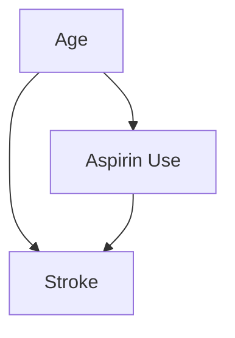

## Introduction
Why do things happen? This fundamental question drives all scientific inquiry, yet the answers are rarely simple. An observed outcome is seldom the result of a single cause but rather the product of a complex web of interconnected factors, both seen and unseen. Mistaking simple correlation for causation can lead to flawed conclusions, from ineffective medical treatments to biased social policies. The critical challenge for any researcher is to move beyond observing associations and begin mapping the actual pathways of influence. This is precisely the gap that Structural Path Analysis is designed to fill. It provides a powerful and intuitive framework for visualizing, testing, and quantifying causal hypotheses.

This article offers a comprehensive exploration of this vital analytical tool. We will first delve into the **Principles and Mechanisms** of path analysis, exploring how Directed Acyclic Graphs (DAGs) serve as blueprints for causality. We'll uncover the logic of mediation and moderation, learn to identify [confounding variables](@entry_id:199777), and see how simple paths can explain complex phenomena. Subsequently, in **Applications and Interdisciplinary Connections**, we will witness this framework in action, embarking on a tour through psychology, public health, ecology, and evolutionary biology to see how path analysis brings clarity to a diverse range of scientific puzzles. By the end, you will understand not just the mechanics of the method, but the way of thinking it enables—a disciplined approach to untangling the intricate causal tapestry of the world.

## Principles and Mechanisms

### The Art of Untangling Causes

Why did that happen? It’s one of the most fundamental questions we ask, as children and as scientists. The world, however, rarely offers a simple answer. An effect is seldom the result of a single, direct cause. Instead, causes and effects are woven together in a complex tapestry of interconnected events. To be a scientist is to be a master weaver, or perhaps an un-weaver, tracing the threads of causality to understand how the world truly works. Structural Path Analysis is the loom we use for this task. It is a way of thinking, a visual language, and a mathematical toolkit for making sense of complex causal chains.

Let's begin with a simple idea. Imagine a map where cities are variables—things we can measure, like age, blood pressure, or income—and the roads between them are causal influences. We draw an arrow from city A to city B if we believe A has a direct effect on B. This simple map is what we call a **causal graph**, or more formally, a **Directed Acyclic Graph (DAG)**. It’s our blueprint for reality. The power of this map is that it forces us to be explicit about our assumptions. What causes what? What doesn't?

Consider a real-world puzzle from medicine: does taking aspirin reduce the risk of a stroke? A naive approach would be to collect data on thousands of people and see if aspirin-takers have fewer strokes. But a hidden actor might be pulling the strings: **age**. Older individuals are more likely to have a stroke, but they are also more likely to be prescribed aspirin for other cardiovascular concerns. In our map, Age is a city with two roads leading out: one to Aspirin Use and one to Stroke.

This creates what’s known as a **confounding** variable. The path $X \leftarrow A \rightarrow Y$ is a "backdoor" path—a non-causal connection that mixes the true effect of [aspirin](@entry_id:916077) with the effect of age . If we don't account for it, we might mistakenly conclude that [aspirin](@entry_id:916077) is ineffective or even harmful, simply because the people taking it were already at higher risk. Our causal map makes this danger obvious. The solution? We must statistically "block" the backdoor path by controlling for age, allowing us to isolate the true causal road we care about: $X \rightarrow Y$.

But these maps also warn us of other traps. Imagine we conduct our study only on hospitalized patients. It might seem like a reasonable choice. Yet, what if both [aspirin](@entry_id:916077) use (perhaps through side effects) and having a stroke can lead to hospitalization? On our map, Hospitalization ($S$) becomes a "[collider](@entry_id:192770)," a city where two roads meet: $X \rightarrow S \leftarrow Y$. By focusing only on hospitalized patients, we are "conditioning on a [collider](@entry_id:192770)." This seemingly innocent act does something strange: it creates a spurious [statistical association](@entry_id:172897) between aspirin and stroke where none might have existed before . It's like noticing that among actors who win an Oscar, talent and luck seem negatively correlated; this doesn't mean they are in general, but within that highly selected group, if you have less of one, you must have had more of the other. Learning to read these causal maps is the first step toward untangling the web of cause and effect.

### The Logic of Pathways: Mediation and Moderation

Once we have a map that we trust, we can start asking more detailed questions. It's not enough to know *that* X causes Y; we want to know *how*. This brings us to the core mechanism of path analysis: **mediation**. A mediator is an intermediate variable, the stepping stone on the causal journey from X to Y. The path looks like a simple chain: $X \rightarrow M \rightarrow Y$.

Think about the psychological toll of a [cancer diagnosis](@entry_id:197439). A study might find that higher cancer-related stress ($X$) is linked to a lower [quality of life](@entry_id:918690) ($Y$). But what is the mechanism? One hypothesis is that stress depletes a patient's **coping [self-efficacy](@entry_id:909344)** ($M$)—their belief in their ability to manage challenges—and it is this loss of efficacy that in turn harms their [quality of life](@entry_id:918690). The effect of stress is *mediated* by [self-efficacy](@entry_id:909344) .

Structural Path Analysis allows us to quantify this. The strength of an indirect path is simply the product of the strengths of its individual links. If a one-unit increase in stress ($X$) causes a $0.5$-unit decrease in [self-efficacy](@entry_id:909344) ($M$), and a one-unit increase in [self-efficacy](@entry_id:909344) causes a $0.4$-unit increase in quality of life ($Y$), then the indirect effect of stress on [quality of life](@entry_id:918690) through this path is $(-0.5) \times (0.4) = -0.20$ . The total influence of stress might flow through several such mediating pathways—perhaps affecting sleep ($M_2$) or social interaction ($M_3$) as well. Path analysis lets us calculate the total indirect effect by simply summing the contributions from each path, telling us exactly how much of the total effect is carried by each intermediate mechanism .

This is distinct from another crucial concept: **moderation**. If mediation tells us *how* an effect is transmitted, moderation tells us *when* or *for whom* an effect holds true. A moderator is a variable that acts like a volume knob, turning the strength of a causal relationship up or down. For our cancer patients, the presence of strong emotional support from a partner ($Z$) might not be on the causal pathway from stress to [quality of life](@entry_id:918690), but it could change the rules entirely. For patients with high support, the negative impact of stress on [quality of life](@entry_id:918690) might be much weaker than for those with low support . The effect is moderated. Understanding the difference between a mediator (a stop on the journey) and a moderator (a factor that changes the condition of the road itself) is fundamental to building nuanced and realistic models of the world .

### Unveiling Nature’s Hidden Mechanisms

The simple logic of paths can lead to profound, even counter-intuitive, discoveries about the natural world. Consider a simple [food chain](@entry_id:143545): predators eat herbivores, and herbivores eat plants. What, then, is the effect of a predator on a plant? The predator doesn't eat the plant, so there is no direct path. Yet, there is an indirect one. By consuming herbivores, predators reduce the number of organisms that graze on plants. The path is: Predator $\xrightarrow{-}$ Herbivore $\xrightarrow{-}$ Plant. The signs represent the nature of the effect (negative, in these cases). The overall indirect effect is the product of the signs: $(-)\times(-) = (+)$. More predators can lead to more plants! This phenomenon, known as a **[trophic cascade](@entry_id:144973)**, is a classic example of an indirect effect revealed by causal thinking .

But path analysis allows us to dig even deeper. The influence of a predator is not just about killing. The mere presence of a predator creates a "[landscape of fear](@entry_id:190269)." An herbivore, like a grasshopper, might change its behavior to avoid being eaten—hiding more, foraging in less risky (and perhaps less nutritious) areas. This change in behavior, or **trait**, also reduces its impact on plants. So, the predator has two distinct causal paths to the plant:

1.  **Density-Mediated Indirect Effect (DMII):** The effect caused by changing the *number* of herbivores (the lethal effect).
2.  **Trait-Mediated Indirect Effect (TMII):** The effect caused by changing the *behavior* of the surviving herbivores (the non-lethal fear effect).

With careful experiments and path analysis, ecologists can measure the strength of the "path of death" versus the "path of fear" . Often, the fear effect alone can be as powerful, or even more powerful, than the effect of direct consumption. It is a beautiful demonstration of how a simple framework can dissect the complex and hidden dramas of nature.

### From Simple Chains to Complex Webs

What happens when we scale up from a three-species [food chain](@entry_id:143545) to a system with thousands of interacting components, like a national economy? The same principles apply, but their expression takes on a new mathematical elegance. In economics, the **Input-Output model** describes how different sectors of an economy rely on each other. To build a car, the auto industry needs steel. To make steel, the steel industry needs coal. To mine coal, the mining industry needs heavy machinery, and so on. The production of a single car sends ripples backwards through a vast economic network.

Structural Path Analysis provides the perfect tool to trace these ripples. The total production needed to meet a country's final demand for goods can be seen as the sum of all production required along every possible supply chain path. This idea is captured beautifully in a single equation from linear algebra involving the "technology matrix" $A$, where $x = (I - A)^{-1}f$. The term $(I - A)^{-1}$ is known as the Leontief Inverse, and it can be expanded into an infinite series:

$$ (I - A)^{-1} = I + A + A^2 + A^3 + \dots $$

This isn't just an abstract formula; it's a story about production paths .
-   The term $I$ represents the final goods themselves (paths of length 0).
-   The term $A$ represents all the direct inputs needed for those final goods (paths of length 1).
-   The term $A^2$ represents the inputs needed to make those direct inputs (paths of length 2).
-   ...and so on, ad infinitum.

Each matrix power $A^k$ sums up the influence of all production chains of length $k$. By decomposing this series, we can identify the most critical supply chains in an economy or trace the "**embodied energy**"—the total energy consumed throughout the supply chain—of a final product . What began as a simple causal chain has become a powerful lens for understanding the complex [circulatory system](@entry_id:151123) of our global economy.

### Paths to Fairness: A Modern Application

The true beauty of a fundamental scientific principle is its universality. Let's take the logic of path analysis from ecology and economics and apply it to one of the most pressing challenges of our time: [algorithmic fairness](@entry_id:143652).

Imagine a hospital uses an AI model to generate a risk score ($\hat{Y}$) for patients. We discover that a sensitive attribute, such as the patient's demographic group ($A$), is correlated with the score. This is an enormous ethical red flag. But to fix it, we must first understand the "how." Path analysis provides the diagnosis.

The influence of $A$ on $\hat{Y}$ might flow through multiple channels. Some may be ethically justifiable, others not .
-   A **permissible path** might be $A \rightarrow B \rightarrow \hat{Y}$, where $B$ is a biological factor that is causally related to the disease and happens to have a different prevalence in group $A$. Here, $A$ is a proxy for a genuine risk factor.
-   An **impermissible path** might be $A \rightarrow S \rightarrow \hat{Y}$, where $S$ represents a socioeconomic factor, like historical access to healthcare, that is a consequence of systemic bias. The algorithm is unfairly penalizing a group for disadvantages they have faced.
-   Worse still, there might be a direct path $A \rightarrow \hat{Y}$, meaning the model is using the sensitive attribute itself (or a close proxy) to make decisions, baking bias directly into its logic.

Structural Path Analysis gives us the ability to draw this map, estimate the strength of each path, and calculate the total effect flowing through all impermissible pathways combined. But it does more than just diagnose the problem; it prescribes the cure. We can create a new, "fair" score, $\hat{Y}^{\star}$, by performing a simple adjustment:

$$ \hat{Y}^{\star} = \hat{Y} - \alpha A $$

And what is the value of $\alpha$? It is precisely the sum of the strengths of all the impermissible paths we identified . In essence, we are performing causal surgery, precisely identifying the toxic pathways and subtracting their influence from the final outcome. The abstract logic of tracing paths becomes a concrete tool for building a more just and equitable world. From the fear of a grasshopper to the architecture of an economy to the ethics of an algorithm, the simple idea of the causal path provides a unified and powerful way to understand, and ultimately to shape, our world.