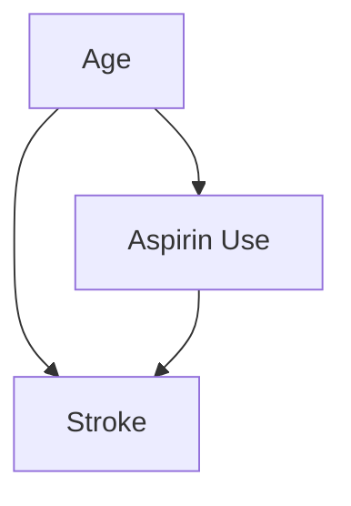

## 引言
事情为什么会发生？这个基本问题驱动着所有科学探究，但答案却鲜有简单的。一个观测到的结果很少是单一原因的产物，而往往是可见与不可见因素交织成的复杂网络的产物。将简单的相关性误认为因果关系，可能导致从无效医疗到有偏见的社会政策等各种错误结论。任何研究者面临的关键挑战是，超越观察关联，开始描绘影响的实际路径。这正是结构[路径分析](@entry_id:753256)旨在填补的空白。它为可视化、检验和量化因果假设提供了一个强大而直观的框架。

本文将对这一至关重要的分析工具进行全面探讨。我们将首先深入探讨[路径分析](@entry_id:753256)的**原理与机制**，探索[有向无环图](@entry_id:164045)（DAGs）如何充当因果关系的蓝图。我们将揭示中介作用和调节作用的逻辑，学习识别[混杂变量](@entry_id:261683)，并了解简单的路径如何解释复杂的现象。随后，在**应用与跨学科联系**部分，我们将见证该框架的实际应用，遍览心理学、公共卫生、生态学和[演化生物学](@entry_id:145480)等领域，看[路径分析](@entry_id:753256)如何为各种科学难题带来清晰的解答。读完本文，您将不仅理解该方法的机理，更能领会它所促成的一种思维方式——一种用于梳理世界复杂因果织锦的严谨方法。

## 原理与机制

### 解构原因的艺术

那件事为什么会发生？这是我们作为孩子和科学家都会提出的最基本的问题之一。然而，世界很少提供简单的答案。一个结果很少是单一、直接原因的产物。相反，原因和结果交织在一张由相互关联的事件组成的复杂织锦中。成为一名科学家，就是成为一名编织大师，或许更像一名解构者，追溯因果关系的线索，以理解世界真正的运作方式。结构[路径分析](@entry_id:753256)就是我们完成这项任务所使用的织布机。它是一种思维方式、一种视觉语言，也是一个用于理解复杂因果链的数学工具包。

让我们从一个简单的想法开始。想象一张地图，上面的城市是变量——我们可以测量的东西，如年龄、血压或收入——而城市之间的道路是因果影响。如果我们认为 A 对 B 有直接影响，我们就在 A 和 B 之间画一个箭头。这张简单的地图就是我们所说的**因果图**，或者更正式地称为**有向无环图（DAG）**。它是我们对现实的蓝图。这张地图的力量在于它迫使我们明确陈述我们的假设。什么导致了什么？什么没有？

思考一个来自医学领域的现实难题：服用阿司匹林能降低中风风险吗？一种天真的方法是收集成千上万人的数据，看看服用阿司匹林的人是否中风次数更少。但可能有一个隐藏的角色在幕后操纵：**年龄**。年长者更可能中风，但他们也更可能因为其他心血管问题而被开具阿司匹林。在我们的地图上，“年龄”是一个有两条路通出的城市：一条通往“服用阿司匹林”，另一条通往“[中风](@entry_id:903631)”。

这就产生了一个所谓的**混杂**变量。路径 $X \leftarrow A \rightarrow Y$ 是一条“后门”路径——一种非因果联系，它将阿司匹林的真实效应与年龄的效应混淆在一起。如果我们不考虑它，我们可能会错误地得出结论，认为阿司匹林无效甚至有害，仅仅因为服用它的人本身就处于更高的风险之中。我们的因果图使这种危险显而易见。解决方案是什么？我们必须通过控制年龄来统计上“阻断”后门路径，从而分离出我们关心的真正因果路径：$X \rightarrow Y$。

但这些地图也警示我们其他陷阱。想象一下，我们只对住院患者进行研究。这似乎是一个合理的选择。然而，如果服用阿司匹林（可能通过副作用）和[中风](@entry_id:903631)都可能导致住院呢？在我们的地图上，住院（$S$）成了一个“对撞点”，一个两条路交汇的城市：$X \rightarrow S \leftarrow Y$。仅仅关注住院患者，我们就是在“对撞点上进行条件化”。这个看似无害的行为会产生奇怪的后果：它在阿司匹林和[中风](@entry_id:903631)之间制造出一种虚假的[统计关联](@entry_id:172897)，而这种关联原本可能并不存在。这就像注意到在获得奥斯卡奖的演员中，才华和运气似乎呈负相关；这并不意味着它们在总体上是负相关的，而是在这个经过高度筛选的群体中，如果你缺少其中一样，你必定拥有更多另一样。学会解读这些因果图是解开因果关系之网的第一步。

### 路径的逻辑：中介与调节

一旦我们有了一张可信的地图，我们就可以开始问更详细的问题。仅仅知道 X 导致 Y 是不够的；我们想知道是*如何*导致的。这就引出了[路径分析](@entry_id:753256)的核心机制：**中介作用**。中介变量是一个中间变量，是 X 到 Y 因果旅程中的垫脚石。路径看起来像一个简单的链条：$X \rightarrow M \rightarrow Y$。

思考一下[癌症诊断](@entry_id:197439)对心理造成的伤害。一项研究可能会发现，较高的癌症相关压力（$X$）与较低的生活质量（$Y$）相关联。但其机制是什么？一种假设是，压力会耗尽患者的**应对[自我效能](@entry_id:909344)**（$M$）——即他们对自己管理挑战能力的信念——而正是这种效能感的丧失反过来损害了他们的生活质量。压力的影响被[自我效能](@entry_id:909344)所*中介* 。

结构[路径分析](@entry_id:753256)使我们能够量化这一点。如果压力（$X$）增加一个单位导致[自我效能](@entry_id:909344)（$M$）下降 0.5 个单位，而[自我效能](@entry_id:909344)增加一个单位导致生活质量（$Y$）提高 0.4 个单位，那么压力通过这条路径对生活质量的间接效应就是 $(-0.5) \times (0.4) = -0.20$ 。压力的总影响可能通过几条这样的中介路径流动——也许还会影响睡眠（$M_2$）或社交互动（$M_3$）。[路径分析](@entry_id:753256)让我们通过简单地将每条路径的贡献相加来计算总间接效应，从而准确地告诉我们每个中间机制承载了总效应的多少 。

这与另一个关键概念不同：**调节作用**。如果中介作用告诉我们效应是*如何*传递的，那么调节作用则告诉我们效应在*何时*或*对谁*成立。调节变量就像一个音量旋钮，可以调高或调低因果关系的强度。对于我们的癌症患者来说，来自伴侣的强大情感支持（$Z$）可能不在从压力到生活质量的因果路径上，但它可能完全改变规则。对于获得高度支持的患者，压力对生活质量的负面影响可能远弱于支持度低的患者 。这种效应被调节了。理解中介变量（旅途中的一站）和调节变量（改变道路本身状况的因素）之间的区别，是构建精细且现实的世界模型的根本 。

### 揭示自然的隐藏机制

路径的简单逻辑可以引导我们对自然界做出深刻、甚至反直觉的发现。考虑一个简单的[食物链](@entry_id:194683)：捕食者吃食草动物，食草动物吃植物。那么，捕食者对植物有什么影响呢？捕食者不吃植物，所以没有直接路径。然而，存在一条间接路径。通过捕食食草动物，捕食者减少了以植物为食的生物数量。路径是：捕食者 $\xrightarrow{-}$ 食草动物 $\xrightarrow{-}$ 植物。符号代表效应的性质（在这些情况下是负向的）。总的间接效应是这些符号的乘积：$(-)\times(-) = (+)$。更多的捕食者可以导致更多的植物！这种现象被称为**[营养级联](@entry_id:137302)**，是因果思维揭示间接效应的经典例子 。

但[路径分析](@entry_id:753256)让我们能够挖掘得更深。捕食者的影响不仅仅在于捕杀。捕食者的存在本身就创造了一个“[恐惧景观](@entry_id:190269)”。像蚱蜢这样的食草动物可能会改变其行为以避免被吃掉——更多地躲藏，在风险较低（也许营养也较差）的区域[觅食](@entry_id:181461)。这种行为或**性状**的改变也减少了它对植物的影响。因此，捕食者通往植物有两条截然不同的因果路径：

1.  **密度介导的间接效应 (DMII):** 由改变食草动物*数量*（致死效应）引起的效应。
2.  **[性状介导的间接效应](@entry_id:198009) (TMII):** 由改变幸存食草动物*行为*（非致死的恐惧效应）引起的效应。

通过精心的实验和[路径分析](@entry_id:753256)，生态学家可以测量“死亡之路”与“恐惧之路”的强度 。通常，仅恐惧效应本身就可能与直接捕食的效应一样强大，甚至更强。这是一个绝佳的示范，说明一个简单的框架如何能够剖析自然界中复杂而隐秘的剧幕。

### 从简单链条到[复杂网络](@entry_id:261695)

当我们从一个三物种的[食物链](@entry_id:194683)扩展到一个拥有成千上万个[相互作用组](@entry_id:893341)件的系统，比如一个国家的经济时，会发生什么？同样的原理依然适用，但其表达方式呈现出一种新的数学优雅。在经济学中，**投入-产出模型**描述了经济中不同部门之间如何相互依赖。为了制造一辆汽车，汽车工业需要钢铁。为了生产钢铁，钢铁工业需要煤炭。为了开采煤炭，采矿业需要重型机械，等等。一辆汽车的生产会通过一个巨大的[经济网络](@entry_id:140520)向后传递涟漪。

结构[路径分析](@entry_id:753256)为追踪这些涟漪提供了完美的工具。满足一个国家最终产品需求所需的总产量，可以看作是沿着所有可能的供应链路径所需产量的总和。这个思想被一个涉及“技术矩阵” $A$ 的线性代数方程优美地捕捉到：$x = (I - A)^{-1}f$。其中 $(I - A)^{-1}$ 被称为[列昂季耶夫逆矩阵](@entry_id:1127166) (Leontief Inverse)，它可以展开成一个[无穷级数](@entry_id:143366)：

$$ (I - A)^{-1} = I + A + A^2 + A^3 + \dots $$

这不仅仅是一个抽象的公式；它是一个关于生产路径的故事 。
-   $I$ 项代表最终产品本身（长度为0的路径）。
-   $A$ 项代表生产这些最终产品所需的所有直接投入（长度为1的路径）。
-   $A^2$ 项代表生产这些直接投入所需的投入（长度为2的路径）。
-   ……以此类推，无穷无尽。

每个矩阵的 $k$ 次幂 $A^k$ 汇总了所有长度为 $k$ 的生产链的影响。通过分解这个级数，我们可以识别出一个经济体中最关键的供应链，或者追踪一个最终产品的“**隐含能源**”——即在整个供应链中消耗的总能源 。最初的简单因果链，如今已成为理解我们全球经济复杂循环系统的有力透镜。

### 通往公平之路：一个现代应用

一个基本科学原理的真正魅力在于其普适性。让我们将[路径分析](@entry_id:753256)的逻辑从生态学和经济学中抽离出来，应用于我们这个时代最紧迫的挑战之一：[算法公平性](@entry_id:143652)。

想象一家医院使用一个 AI 模型为患者生成风险评分（$\hat{Y}$）。我们发现，某个敏感属性，如患者的[人口统计学](@entry_id:143605)分组（$A$），与该评分相关。这是一个巨大的伦理警示。但要解决这个问题，我们必须首先理解其“如何”发生。[路径分析](@entry_id:753256)提供了诊断方法。

$A$ 对 $\hat{Y}$ 的影响可能通过多个渠道流动。其中一些在伦理上是正当的，而另一些则不然 。
-   一条**可接受的路径**可能是 $A \rightarrow B \rightarrow \hat{Y}$，其中 $B$ 是一个与疾病有因果关系的生物学因素，并且恰好在 $A$ 组中具有不同的[患病率](@entry_id:168257)。在这里，$A$ 是一个真实风险因素的代理变量。
-   一条**不可接受的路径**可能是 $A \rightarrow S \rightarrow \hat{Y}$，其中 $S$ 代表一个社会经济因素，如历史上获得医疗保健的机会，这是系统性偏见的结果。该算法不公平地惩罚了一个群体，因为他们曾面临这些劣势。
-   更糟糕的是，可能存在一条直接路径 $A \rightarrow \hat{Y}$，这意味着模型正在使用敏感属性本身（或一个非常接近的代理变量）来做决策，将偏见直接固化到其逻辑中。

结构[路径分析](@entry_id:753256)让我们能够绘制这张地图，估算每条路径的强度，并计算流经所有不可接受路径的总效应。但它不仅仅是诊断问题，它还开出了药方。我们可以通过一个简单的调整来创建一个新的、“公平的”分数 $\hat{Y}^{\star}$：

$$ \hat{Y}^{\star} = \hat{Y} - \alpha A $$

那么 $\alpha$ 的值是什么呢？它恰好是我们识别出的所有不可接受路径的强度之和 。从本质上讲，我们正在进行一次因果手术，精确地识别出有害的路径，并从最终结果中减去它们的影响。追踪路径的[抽象逻辑](@entry_id:635488)变成了一个具体的工具，用以建设一个更加公正和平等的世界。从蚱蜢的恐惧，到经济的架构，再到算法的伦理，因果路径这个简单的概念提供了一种统一而强大的方式来理解，并最终塑造我们的世界。

