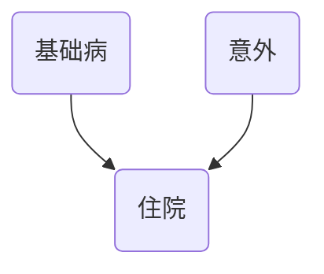

## 引言
在科学探索和日常决策中，我们不断面对一个核心挑战：如何从“X与Y一同发生”（关联）的观察中，跃升至“X导致了Y”（因果）的结论。这种区分是[循证医学](@entry_id:918175)、公共政策制定乃至人工智能发展的基石。然而，从数据中观察到的关联往往被混杂因素和[选择偏倚](@entry_id:172119)所扭曲，导致错误的结论。本文旨在填补这一认知鸿沟，系统性地介绍从关联中辨别因果的理论框架与实用方法。

本文将分为三个核心部分。在 **“原理与机制”** 一章中，我们将深入探讨因果推断的根本问题，引入潜在结局和[有向无环图](@entry_id:164045)（DAGs）等核心概念，并阐明随机化为何是因果推断的“金标准”，以及在[观察性研究](@entry_id:906079)中必须满足的严格假设。接下来，在 **“应用与[交叉](@entry_id:147634)学科联系”** 一章中，我们将看到这些原理如何在[临床试验分析](@entry_id:172914)、[观察性研究设计](@entry_id:924120)、[个性化医疗](@entry_id:914353)、[孟德尔随机化](@entry_id:147183)乃至社会科学和人工智能等多个领域得到应用，展现其强大的跨学科生命力。最后，在 **“动手实践”** 部分，你将通过解决具体问题，亲手运用这些理论来处理混杂、[对撞偏倚](@entry_id:163186)和[工具变量](@entry_id:142324)等经典场景，从而将理论[知识转化](@entry_id:893170)为实践技能。

通过这趟旅程，您将构建起一套严谨的思维体系，学会如何审慎地提出因果问题，并使用恰当的工具从复杂数据中探寻可靠的答案。

## 原理与机制

我们生活在一个充满了关联的世界里。报纸头条宣称某种新饮食能延长寿命，或者某种药物与罕见的副作用有关。我们天生就是模式识别的能手，但我们真正渴望知道的，远不止是“什么与什么一同发生”。我们想知道“是什么 *导致* 了什么”。我们想知道，如果我们干预这个世界——如果我们服用那种药，或者开始那种饮食——将会发生什么。这种从“关联”到“因果”的飞跃，是科学的核心，也是我们在本章中要探索的迷人旅程。

### [反事实](@entry_id:923324)的幽灵：因果推断的核心困境

想象一下，你头痛，于是吃了一片阿司匹林。一小时后，头痛消失了。是阿司匹林治好了你的头痛吗？为了确切地回答这个问题，你需要一个“平行宇宙”的你：一个在完全相同的时间、完全相同的状态下，但是 *没有* 吃阿司匹林的你。然后，你可以比较这两个“你”的结局。如果没吃药的你头痛依旧，而吃药的你头痛消失了，那么你就找到了强有力的证据。

这个“平行宇宙”中的结局，我们称之为 **[反事实](@entry_id:923324)（counterfactual）**。对于任何一个个体，我们引入 **潜在结局（potential outcomes）** 的概念来形式化这个想法 。假设我们考虑一个治疗（$X=1$）和一种对照（$X=0$）。对于同一个人，存在两个潜在结局：
- $Y(1)$：如果这个人接受治疗，将会发生的结局。
- $Y(0)$：如果这个人接受对照处理，将会发生的结局。

对于我们现实世界中的你，如果你吃了阿司匹林（$X=1$），你观察到的结局 $Y$ 就是 $Y(1)$。但与此同时，$Y(0)$——那个“没吃药的你”的结局——就成为了一个永远无法观测到的[反事实](@entry_id:923324)。反之亦然。我们永远无法在同一个人身上同时观测到 $Y(1)$ 和 $Y(0)$。这就是 **因果推断的根本问题（Fundamental Problem of Causal Inference）**。我们被困在了现实的一个分支里，而因果效应——对于个体而言，即 $Y(1) - Y(0)$——的另一半则像一个幽灵，永远无法触及。

那么，我们是不是就此束手无策了呢？并非如此。虽然我们无法知道 *个体* 的因果效应，但科学的威力在于，它能让我们在 *群体* 层面上去估计 **[平均因果效应](@entry_id:920217)（Average Causal Effect, ATE）**，即 $\mathbb{E}[Y(1)] - \mathbb{E}[Y(0)]$。但这需要非常巧妙的逻辑和严格的假设。

### 完美的解决方案：[随机化](@entry_id:198186)的魔力

想象我们能用一种神力来克服这个根本问题。这种神力就是 **[随机化](@entry_id:198186)**。在一个理想的 **[随机对照试验](@entry_id:909406)（Randomized Controlled Trial, R[CT](@entry_id:747638)）** 中，我们将一大群参与者用类似抛硬币的方式随机分配到治疗组（$X=1$）和对照组（$X=0$）。

随机化为什么如此强大？因为它创造了奇迹般的平衡。通过随机分配，治疗组和[对照组](@entry_id:747837)在接受干预 *之前*，在所有可以想象到的特征上——无论是年龄、性别、病情严重程度，还是我们甚至没有想到或无法测量的基因、生活习惯——都变得在统计上是相同的。两组就像是彼此的镜像。我们称这种特性为 **[可交换性](@entry_id:909050)（exchangeability）** 。

因为两组在所有基线特征上都实现了平衡，所以治疗组的平均潜在结局 $\mathbb{E}[Y(1)]$ 与对照组的平均潜在结局 $\mathbb{E}[Y(1)]$ 应该是相同的。同样，$\mathbb{E}[Y(0)]$ 在两组间也应该相同。由于[随机化](@entry_id:198186)，我们可以说治疗分配 $X$ 与潜在结局 $(Y(0), Y(1))$ 是相互独立的。

这就引出了一个美妙的推论。在治疗组中，我们观察到的平均结局是 $\mathbb{E}[Y \mid X=1]$。根据一致性假设（我们稍后会详谈），这等于 $\mathbb{E}[Y(1) \mid X=1]$。但由于[可交换性](@entry_id:909050)，那些“碰巧”被分到治疗组的人和整个人群在潜在结局上并无不同，所以 $\mathbb{E}[Y(1) \mid X=1] = \mathbb{E}[Y(1)]$。

瞧！我们把一个无法观测的量（人群的平均潜在结局 $\mathbb{E}[Y(1)]$）和一个可以直接从数据中计算出来的量（治疗组的平均观察结局 $\mathbb{E}[Y \mid X=1]$）联系了起来。同样，$\mathbb{E}[Y(0)]$ 等于 $\mathbb{E}[Y \mid X=0]$。因此，在R[CT](@entry_id:747638)中，[平均因果效应](@entry_id:920217)就是两组观察结局的简单差值：
$$
\text{ATE} = \mathbb{E}[Y(1)] - \mathbb{E}[Y(0)] = \mathbb{E}[Y \mid X=1] - \mathbb{E}[Y \mid X=0]
$$
关联等于因果。随机化为我们提供了一个清晰、无偏的因果效应度量，它是评估医学干预的“金标准”。

### 步入真实世界：关联如何伪装成因果

然而，在真实世界中，我们不可能事事都做R[CT](@entry_id:747638)。我们的大部分数据都来自于 **[观察性研究](@entry_id:906079)（observational studies）**——我们只是“观察”医生和病人做了什么，而不是“干预”他们。在这里，关联与因果的道路开始分岔。

让我们来看一个具体的医学场景 。一项研究观察了[抗凝药物](@entry_id:154234)对住院病人的影响，结局是30天内是否发生[中风](@entry_id:903631)。数据汇总后，研究者惊奇地发现：
- 接受治疗的1000名患者中，有250人[中风](@entry_id:903631)（风险为 $0.25$）。
- 未接受治疗的1000名患者中，有160人[中风](@entry_id:903631)（风险为 $0.16$）。

表面上看，治疗组的[中风](@entry_id:903631)风险更高（$0.25$ 对 $0.16$）！难道这种药物有害吗？这就是原始的 **关联（association）**，它暗示了一个令人不安的结论。

但作为一个敏锐的科学家，你必须提出质疑。医生是根据什么来决定给谁用药的？常识告诉我们，医生更倾向于给病情更重的患者使用更激进的治疗。在这里，病情的 **严重程度（severity）** 可能是一个 **混杂因素（confounder）**。它像一个幕后黑手，同时影响着“是否用药”和“是否[中风](@entry_id:903631)”。

为了更清晰地思考这个问题，我们可以使用一种强大的思维工具：**[有向无环图](@entry_id:164045)（Directed Acyclic Graphs, DAGs）**。我们可以画出我们关于这个世界因果关系的假设：

```mermaid
graph TD
    S(病情严重程度) --> X(接受治疗);
    S --> Y([中风](@entry_id:903631));
    X --> Y;
```

在这个图中，箭头表示因果影响。病情严重程度（$S$）既会导致医生给药（$S \rightarrow X$），也会直接导致更高的[中风](@entry_id:903631)风险（$S \rightarrow Y$）。这种 $X \leftarrow S \rightarrow Y$ 的结构被称为 **[共同原因](@entry_id:266381)（common cause）** 结构。它在治疗 $X$ 和结局 $Y$ 之间打开了一条“后门路径（back-door path）”。这条非因果路径产生了虚假的关联，污染了我们对 $X \rightarrow Y$ 这条真实因果路径的判断。这种现象在医学研究中非常普遍，被称为 **适应证混杂（confounding by indication）**，即患者接受治疗的指征（即病情）本身就与结局相关。

### 拨开迷雾：调整与标准化的力量

我们该如何关闭这条“后门路径”，揭示真相呢？策略很简单，也很符合直觉：**让比较变得公平**。我们不应该把“病情严重的治疗组”和“病情轻微的未治疗组”直接比较。我们应该在相同的起跑线上进行比较。

让我们回到那个数据 。假设我们把病人按病情严重程度（轻微 vs. 严重）分开来看：
- 在 **轻微** 患者中：治疗组风险为 $10/200 = 0.05$，未治疗组风险为 $80/800 = 0.10$。治疗降低了风险！
- 在 **严重** 患者中：治疗组风险为 $240/800 = 0.30$，未治疗组风险为 $80/200 = 0.40$。治疗也降低了风险！

在每个亚组内，药物都显示出保护作用。这与我们最初看到的总体结果完全相反！这就是著名的 **[辛普森悖论](@entry_id:136589)（Simpson's Paradox）**。悖论的产生，正是因为混杂因素（病情严重程度）在治疗组和未治疗组中的[分布](@entry_id:182848)不均。

我们刚刚做的[分层](@entry_id:907025)分析，其本质是一种叫做 **调整（adjustment）** 或 **[标准化](@entry_id:637219)（standardization）** 的过程。我们可以用一个更形式化的问题来思考：如果整个人群都接受了治疗（或都未接受治疗），但人群中轻、重症患者的比例保持不变，那么结局会是怎样？

这个问题的答案可以通过 **G公式（g-formula）** 来计算：
$$
\mathbb{E}[Y(x)] = \sum_{z} \mathbb{E}[Y \mid X=x, Z=z] P(Z=z)
$$
其中，$x$ 代表治疗状态（1或0），$z$ 代表混杂因素（如病情严重程度）的每个层面。这个公式的逻辑是：在混杂因素的每个层内，我们用观察到的条件风险 $\mathbb{E}[Y \mid X=x, Z=z]$ 来估计该层内的因果风险。然后，我们用该层在 **总人群** 中的比例 $P(Z=z)$ 作为权重，将各层的风险加权平均起来。

应用这个公式到我们的例子中，我们得到治疗的[平均因果效应](@entry_id:920217)是 $-0.075$，明确显示了药物的保护作用 。通过“调整”病情严重程度这个混杂因素，我们成功地从误导性的关联中提炼出了真实的因果关系。

### [观察性研究](@entry_id:906079)的“游戏规则”

我们刚刚看到，通过巧妙的调整，[观察性研究](@entry_id:906079)似乎也能回答因果问题。但这并非没有代价。为了让这种从关联到因果的推断有效，我们必须遵循三条严格的“游戏规则”，或者说，做出三个关键的、有时是无法验证的假设。

1.  **一致性与稳定单位治疗价值假设 (SUTVA)**
    这条规则要求我们的“治疗”定义必须是清晰无误的。它包含两个方面：
    - **治疗版本唯一性（Treatment Version Equivalence）**：当我们说“治疗”时，它必须指代的是一个具体的、单一的干预。如果我们研究“[他汀类药物](@entry_id:167025)”的效果，但数据中包含了高强度[他汀](@entry_id:167025)和低强度[他汀](@entry_id:167025)，而这两种[他汀](@entry_id:167025)的效果本身就不同，那么“[他汀](@entry_id:167025)的潜在结局”$Y(\text{他汀})$ 就变得模棱两可，定义不清晰 。我们的因果问题必须足够精确。
    - **无干涉（No Interference）**：一个人的潜在结局不应受到其他人是否接受治疗的影响。这个假设在很多情况下是合理的，但在某些领域，如疫苗研究中，它显然是失效的 。我的感染风险不仅取决于我是否[接种](@entry_id:909768)疫苗，还取决于我周围有多少人[接种](@entry_id:909768)了疫苗（即“[群体免疫](@entry_id:139442)”）。在这种情况下，简单的 $Y(x)$ 记号失效了，我们需要更复杂的模型来定义和估计直接效应和[溢出](@entry_id:172355)效应。

2.  **[条件可交换性](@entry_id:896124) (Conditional Exchangeability)**
    这是最核心、也最需要信念的假设。它声明：一旦我们对一组可观测的混杂因素 $Z$ 进行了调整（或“条件化”），那么在 $Z$ 的任何一个特定层内，治疗的分配就变得“如同随机”了。也就是说，我们假设在病情相同的患者中，那些最终接受治疗和未接受治疗的人，在所有其他（未测量的）影响结局的特征上都是相似的。
    $$
    (Y(0), Y(1)) \perp X \mid Z
    $$
    这个假设也被称为 **“无未测量混杂”（no unmeasured confounding）**。这是我们进行[观察性研究](@entry_id:906079)时的一个“信仰之跃”，因为我们永远无法证明我们已经测量并调整了 *所有* 相关的混杂因素。

3.  **正性 (Positivity)**
    这个假设听起来很技术性，但道理很简单：要想比较，就必须有可比的对象。正性要求，对于我们想要调整的混杂因素的每一个组合（每一个 $z$），都必须存在接受治疗的个体（$X=1$）和未接受治疗的个体（$X=0$）。换句话说，对于任何一个亚组，接受治疗的概率都必须大于0且小于1。
    想象一下，如果医院的规定是“所有重症患者都必须使用[抗凝](@entry_id:911277)药，所有轻症患者都不能使用”。那么，我们就永远无法从数据中知道“一个重症患者如果不使用[抗凝](@entry_id:911277)药会怎样”，因为这样的数据根本不存在。我们的数据中出现了“空洞”，使得在那个亚组内的因果比较成为不可能。

只有当这三个假设同时成立时，我们才能充满信心地使用调整方法（如G公式）来估计因果效应。

### 阴影中的危险：当“调整”引入偏倚

调整是一个强大的工具，但如果使用不当，它不仅无法消除偏倚，反而会制造偏倚。一个最微妙也最危险的陷阱叫做 **[对撞偏倚](@entry_id:163186)（collider bias）**。

一个 **对撞体（collider）** 是一个由两个或多个其他变量共同导致的变量。让我们想象一个情景 ：一个人是否 **住院（H）**，可能取决于他是否有 **某种基础病（X）**，也可能取决于他是否发生了 **一场意外（Y）**。假设基础病和发生意外这两件事本身是完全独立的。


这里的“住院”$H$ 就是一个对撞体，因为它被 $X$ 和 $Y$ 的箭头“撞”向。现在，如果我们决定只研究住院的病人，也就是在我们的分析中“调整”了住院状态，会发生什么？

想象一下，我们从住院病人中随机抽取一个。如果发现他 *没有* 基础病（$X=0$），但我们知道他住院了，我们会推断什么？我们很可能会推断，他住院的原因一定是因为他经历了一场 *更严重* 的意外（$Y=1$）。反之，如果他发生的是一场小意外，那他能住院，很可能说明他有基础病。在这个住院病人的[子集](@entry_id:261956)中，$X$ 和 $Y$ 不再独立，它们产生了虚假的负相关！

这就是[对撞偏倚](@entry_id:163186)：对一个共同效应（对撞体）进行条件化（例如，通过选择一个特定的样本[子集](@entry_id:261956)），会在其多个独立的原因之间制造出虚假的关联。这是一个至关重要的警告：**不是所有变量都适合用来调整**。

那么，我们应该调整什么，不应该调整什么呢？DAGs 再次为我们提供了清晰的指引，这就是 **[后门准则](@entry_id:926460)（Back-door Criterion）**。简单来说，一个有效的调整变量集 $\mathcal{S}$ 必须满足：
1.  它能阻断所有从 $X$ 到 $Y$ 的“后门路径”（即那些以指向 $X$ 的箭头开头的路径）。
2.  它不能包含任何 $X$ 的“后代”（即由 $X$ 导致的变量，如中介者），也不能通过调整打开新的关联路径（如调整对撞体）。

这套规则为我们在复杂的变量网络中选择正确的调整变量提供了坚实的理论基础。

### 提出正确的问题：ATE, ATT, 还是 [ATC](@entry_id:907449)?

最后，即使我们掌握了所有的工具和规则，我们还需要确保我们问的是正确的问题。[平均因果效应](@entry_id:920217)（ATE）并非唯一的因果 estimand（估计量）。根据我们的政策或临床目标，我们可能对以下不同的问题感兴趣 ：

- **平均[处理效应](@entry_id:636010) (ATE, Average Treatment Effect)**: $\mathbb{E}[Y(1) - Y(0)]$
  - 问题：“如果我们将这项干预措施推广到 *整个人群*，平均效果会是什么？” 这是评估普遍性政策的理想指标。

- **处理组平均[处理效应](@entry_id:636010) (ATT, Average Treatment effect on the Treated)**: $\mathbb{E}[Y(1) - Y(0) \mid X=1]$
  - 问题：“对于那些 *已经* 接受了治疗的人来说，他们从中获得的实际益处（或害处）有多大？” 这个指标对于评估现有项目的效果、决定是否需要改进或终止至关重要。

- **[对照组](@entry_id:747837)平均[处理效应](@entry_id:636010) ([ATC](@entry_id:907449), Average Treatment effect on the Controls)**: $\mathbb{E}[Y(1) - Y(0) \mid X=0]$
  - 问题：“如果我们把治疗扩大到那些 *目前尚未* 接受治疗的人群，他们将会获得多大的效果？” 这是决定是否扩大干预范围的关键。

在R[CT](@entry_id:747638)中，由于随机化，ATE、ATT和[ATC](@entry_id:907449)通常是相等的。但在[观察性研究](@entry_id:906079)中，治疗组和[对照组](@entry_id:747837)可能存在系统性差异（例如，治疗组病情更重），这会导致这三个量不相等。选择哪个量，取决于你想回答的具体问题。

### 结语

从一个简单的关联，到一个深刻的因果问题，我们开启了一段迷人的智力旅程。我们遭遇了“[反事实](@entry_id:923324)”这个根本障碍，见证了“[随机化](@entry_id:198186)”的优雅力量。为了应对数据杂乱的真实世界，我们发展出了一套强大的逻辑框架——潜在结局和DAGs，以及一套实用的工具——调整和[标准化](@entry_id:637219)。

然而，这条路并非坦途。我们必须时刻警惕脚下的假设（SUTVA、[可交换性](@entry_id:909050)、正性），并避开潜伏的陷阱（如[对撞偏倚](@entry_id:163186)）。最终，我们学会了不仅要找到答案，更要精确地定义我们所问的问题（ATE、ATT或[ATC](@entry_id:907449)）。

区分关联与因果，远不止是一套统计技术。它是一种严谨的思维方式，一种在复杂和不确定的世界中探求真相的科学艺术。这套原理和机制的美妙之处在于，它们为我们提供了一张地图，指引我们如何谨慎而勇敢地从“看到什么”走向“知道为什么”。