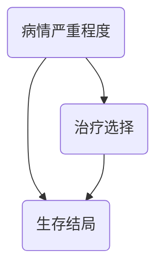

## 引言
在生物医学领域，从“关联”迈向“因果”是推动医学进步的根本动力。一个新疗法是否真的有效？一种生活方式是否真的致病？这些问题的答案直接影响临床决策和[公共卫生](@entry_id:273864)。然而，在真实世界的[观察性研究](@entry_id:906079)中，[混杂偏倚](@entry_id:635723)（Confounding Bias）等各种陷阱普遍存在，常导致我们得出错误甚至完全相反的结论。那么，我们如何才能在充满偏倚的数据迷雾中，拨云见日，探寻因果关系的真相？这正是现代因果推断科学致力于解决的核心难题。

本文将系统性地引导读者穿越这一迷人的领域。在**“原理与机制”**一章中，我们将学习因果推断的语言——[潜在结果框架](@entry_id:636884)和有向无环图（DAGs），理解偏倚的本质。接着，在**“应用与交叉学科联系”**中，我们将看到这些理论如何在真实世界的生物医学研究中大放异彩，如通过[目标试验模拟](@entry_id:921058)和[孟德尔随机化](@entry_id:147183)等方法。最后，通过**“动手实践”**，读者将有机会亲手应用这些知识来解决具体问题。这趟旅程不仅是学习一套统计方法，更是一次思维方式的重塑，它将赋予您在复杂数据中进行严谨科学推理的能力。

## 原理与机制

在科学探索的旅程中，很少有问题像“如果……会怎样？”这样既根本又令人着迷。一位病人接受了新药，然后康复了。我们庆祝胜利，但一个幽灵般的问题萦绕不去：如果她没有服用这种药，会发生什么？她会康复吗，还是会更糟？我们永远无法在同一个人身上同时观测到这两种情况——这便是“因果推断的根本难题”。然而，人类的好奇心怎会就此止步？为了捕捉这个幽灵，科学家们构想出了一套优美而强大的思想体系，让我们得以窥见那条“未选择的路”。

### 平行宇宙的语言：[潜在结果](@entry_id:753644)与SUTVA

让我们进行一个思想实验。对于任何一个个体（比如一个病人），我们想象存在两个“[潜在结果](@entry_id:753644)”（Potential Outcomes）。一个是当她接受治疗（比如服用新药，记为$A=1$）时会发生的健康结局，我们称之为$Y(1)$；另一个是当她接受对照处理（比如服用安慰剂，记为$A=0$）时的结局，我们称之为$Y(0)$。这两个[潜在结果](@entry_id:753644)，如同存在于平行宇宙中的两个自我，共同定义了治疗对这个特定个体的因果效应：$Y(1) - Y(0)$。

当然，我们无法衡量单个个体的因果效应，但我们可以退而求其次，去估计一群人的“平均治疗效应”（Average Treatment Effect, ATE）：$E[Y(1) - Y(0)]$。这个量代表了在整个目标人群中，实施治疗相对于不实施治疗，平均而言能够带来多大的改变。

然而，在我们兴高采烈地用这个公式去探索世界之前，必须先停下来，像物理学家定义一个概念那样，确保我们的语言是精确无误的。这个看似简单的$Y(a)$符号，背后隐藏着一个深刻的假设，科学家们称之为“稳定单元治疗价值假设”（Stable Unit Treatment Value Assumption, SUTVA）。SUTVA包含两个看似平淡无奇，实则至关重要的部分。

第一，**无干涉（No Interference）**。这意味着一个人的[潜在结果](@entry_id:753644)，只取决于他自己接受了何种处理，而与其他人是否接受治疗无关。在一个[肿瘤](@entry_id:915170)病房里，如果一位病人接受了极其耗费医护资源的[靶向治疗](@entry_id:261071)，导致其他病人得到的关注减少，那么“无干涉”假设可能就被打破了。我的结局$Y(0)$（未接受靶向治疗），会因为我的病友是否接受治疗$A=1$而改变。在这种情况下，一个简单的$Y(0)$符号就不足以描述现实了。

第二，**一致性（Consistency）**，或者说“**没有隐藏的治疗版本**”。当我们写下$Y(1)$时，我们默认所有被标记为“治疗1”的操作都是完全相同的。想象一项评估“强化[抗凝](@entry_id:911277)”效果的多中心心脏病研究。如果A中心用的是A药物，B中心用的是B药物，C中心虽然也用A药物但剂量和方案完全不同，那么把这些五花八门的操作全都笼统地标记为$A=1$就是一种懒惰，甚至是一种欺骗。病人的结局取决于他具体接受了哪种药物、哪个方案，而不仅仅是医生在他病历上勾选了“强化[抗凝](@entry_id:911277)”。$Y(1) $这个符号的意义变得模糊不清，因果推断的大厦便失去了坚实的地基。

因此，定义一个清晰、可操作的干预措施，并审慎地思考SUTVA是否成立，是我们开启任何因果探索之旅的第一步。只有这样，我们想测量的目标——ATE，才是一个**定义良好（well-defined）**的因果估算量。

### [辛普森悖论](@entry_id:136589)：[混杂偏倚](@entry_id:635723)的惊鸿一瞥

一旦我们明确了想问什么，接下来的问题就是“如何知道？”。最天真的想法莫过于直接比较：看看服药组的平均结局和未服药组的平均结局有多大差异，即$E[Y \mid A=1] - E[Y \mid A=0]$。然而，现实世界充满了“欺骗”，其中最著名的一种，莫过于**[辛普森悖论](@entry_id:136589)（Simpson's Paradox）**。

让我们来看一个震撼人心的真实医学场景。一项[观察性研究](@entry_id:906079)评估一种新[生物制剂](@entry_id:926339)对[脓毒症](@entry_id:156058)休克的疗效，结局是生存率。数据显示：
- 接受新药治疗的200名患者中，88人存活，生存率**$0.44$**。
- 接受标准治疗的200名患者中，132人存活，生存率**$0.66$**。

结果令人沮丧：新药似乎在“杀死”病人！它的生存率远低于标准疗法。这是否意味着应该立刻停止这项研究？

别急，让我们扮演一个更细心的侦探。一个关键问题是：在真实世界里，医生是怎样决定给谁用新药的？通常，他们会把最新、最强的武器留给最危重的病人。这种“**因症致混杂**”（confounding by indication）的现象普遍存在。

于是，研究者按病情严重程度（$Z$）将病人分为“低危组”和“高危组”，然后重新审视数据：
- **低危组（$Z=0$）**：
    - 新药组生存率：$16/20 = 0.80$
    - 标准治疗组生存率：$126/180 = 0.70$
    - *结论：新药更优！*

- **高危组（$Z=1$）**：
    - 新药组生存率：$72/180 = 0.40$
    - 标准治疗组生存率：$6/20 = 0.30$
    - *结论：新药依然更优！*

奇迹发生了！当我们将病人[分层](@entry_id:907025)后，在每一个层内，新药都显示出明确的益处。整体上看似有害的关联，分解后却揭示出截然相反的真相。这就是[辛普森悖论](@entry_id:136589)。

悖论的根源在于**混杂（Confounding）**。病情严重程度$Z$就是一个**混杂因素（Confounder）**，因为它同时与治疗选择$A$（医生倾向于给重症患者用新药）和结局$Y$（重症患者[死亡率](@entry_id:904968)更高）相关。crude的比较，实际上是在拿“predominantly高危的新药组”和“predominantly低危的标准治疗组”作比较，这显然是不公平的。

解决悖论的方法，就是“**调整（adjustment）**”混杂因素——在可比的人群中进行比较。通过[分层](@entry_id:907025)，我们在病情严重程度相似的病人内部进行了公平比较。为了得到一个总体的效应估计，我们可以进行“**[标准化](@entry_id:637219)（standardization）**”：假设两组病人的病情严重程度[分布](@entry_id:182848)完全相同（例如，都和总人群一样是$50\%$低危，$50\%$高危），然后用层内效应计算出调整后的总生存率。经过计算，新药组的[标准化](@entry_id:637219)生存率为$0.60$，而标准治疗组为$0.50$。结论反转：新药平均能提升$10\%$的生存率！

### 因果关系地图：有向无环图（DAGs）

[辛普森悖论](@entry_id:136589)生动地展示了混杂的威力，但我们需要一个更普适、更系统化的工具来思考和应对它。这就是**有向无环图（Directed Acyclic Graphs, DAGs）**的用武之地。DAGs是一种优雅的图形语言，它让我们能够将关于世界如何运作的科学假设，清晰地画成一张“因果地图”。

在这张地图上，节点代表变量（如治疗、结局、混杂因素），箭头代表直接的因果影响。例如，刚才的[脓毒症](@entry_id:156058)故事可以用一个简单的DAG来表示：

$A$指向$Y$的箭头（$A \rightarrow Y$）代表我们关心的、从治疗到结局的**因果路径**。而$A \leftarrow L \rightarrow Y$这条路径，像一条从$A$的“后门”溜到$Y$的路径，它不代表因果效应，而是由[共同原因](@entry_id:266381)$L$产生的**非因果关联**。这种路径被称为**后门路径（Backdoor Path）**。

[混杂偏倚](@entry_id:635723)，在DAG的语言里，就是由未被阻断的后门路径所引起的。如何阻断它们？答案是**调整**，或者专业术语叫**conditioning**。**[后门准则](@entry_id:926460)（Backdoor Criterion）**告诉我们：要识别$A$对$Y$的因果效应，我们需要找到一组变量（比如$L$），对它们进行调整，从而阻断所有从$A$到$Y$的后门路径。这里的“阻断”就像在路上设置了路障。对$L$进行调整，就阻断了$A \leftarrow L \rightarrow Y$这条路。

通过调整一个充分的[协变](@entry_id:634097)量集合，我们就满足了一个被称为“**[条件可交换性](@entry_id:896124)（Conditional Exchangeability）**”的关键假设：$Y(a) \perp\kern-5pt\perp A \mid L$。它的意思是，在$L$的任何一个特定层内（比如，在所有“高危”病人中），接受治疗$A$与否就如同随机分配的一样，与他们的[潜在结果](@entry_id:753644)无关。这正是我们通过[分层](@entry_id:907025)操作想要达成的理想状态。

### 调整的“暗面”：[对撞偏倚](@entry_id:163186)

既然调整如此强大，是否意味着我们应该把所有测量到的变量都扔进模型里进行“调整”呢？答案是：绝对不是！这正是因果推断中最反直觉、也最迷人的地方之一：**错误的调整会创造偏倚，而非消除它**。

让我们来看一种特殊的结构，**对撞结构（Collider Structure）**：$A \rightarrow C \leftarrow U$。变量$C$是$A$和$U$的共同效应，箭头在$C$处“对撞”，因此$C$被称为**对撞点（Collider）**。在默认情况下，这条路径是**天然阻断**的，调整$C$之前的$A$和$U$之间没有关联。但神奇的是，一旦我们对$C$进行调整（比如，只选择$C$取某个特定值的子样本进行分析），这条路就会被**打开**，从而在$A$和$U$之间凭空制造出关联。

一个经典的例子是“**伯克森悖论**”（Berkson's Paradox）。假设院前急救措施$A$和潜在病情严重性$U$是相互独立的，但两者都会增加病人被送入ICU（$C=1$）的概率。在全体人群中，$A$和$U$无关。但如果我们只研究ICU里的病人（即conditioning on $C=1$），会发生什么？想象一下，我们看到一个ICU病人，但他并没有接受积极的院前急救（$A=0$）。我们会如何推理？我们会想：“既然他没有因为积极抢救而被送进来，那他本身一定病得非常重（$U=1$的概率很高）。” 反之，一个接受了积极抢救（$A=1$）的ICU病人，他病情严重$U=1$的概率可能就相对低一些（他可能只是因为抢救措施本身而被送进ICU观察）。这样一来，在ICU病人这个[子集](@entry_id:261956)中，$A$和$U$之间就出现了一种虚假的负相关。如果$U$还影响最终结局$Y$（$U \rightarrow Y$），那么这种[虚假关联](@entry_id:910909)就会传导到$A$和$Y$之间，导致我们错误地估计了$A$对$Y$的效应。这就是**[对撞偏倚](@entry_id:163186)（Collider Bias）**。

M-bias是collider bias的一种更[隐蔽](@entry_id:196364)的形式。考虑这样的结构：$A \leftarrow L_1 \rightarrow C \leftarrow L_2 \rightarrow Y$。这里，$A$和$Y$之间没有任何开放的后门路径，它们是边缘独立的，不存在混杂。但一个研究者可能会观察到$C$与$A$和$Y$都有关联（通过$L_1$和$L_2$），从而错误地决定“调整”$C$。由于$C$是一个对撞点，这个调整操作打开了$A \leftarrow L_1 \rightarrow C \leftarrow L_2 \rightarrow Y$这条路径，从而**无中生有地制造了偏倚**。

这个教训是深刻的：**调整并非总是好事**。我们不能盲目地将所有与治疗或结局相关的变量都作为“混杂因素”进行调整。我们需要一张因果地图（DAG）来指导我们，告诉我们该调整什么（confounders on backdoor paths）和不该调整什么（colliders or mediators on causal paths）。同时，这也提醒我们，[混杂偏倚](@entry_id:635723)只是众多偏倚中的一种，还有**[信息偏倚](@entry_id:903444)（Information Bias）**，比如[测量误差](@entry_id:270998)，它源于数据收集的瑕疵，无法通过调整[协变](@entry_id:634097)量来解决。

### 现实的枷锁：可识别性的实践障碍

即便我们手握完美的因果地图，知道该调整哪些变量，现实世界依然会给我们设置障碍。其中最主要的一个就是**正性假设（Positivity Assumption）**。

正性假设要求，在由[协变](@entry_id:634097)量定义的任何一个亚群（stratum）中，接受每一种治疗方案的概率都必须大于零。换句话说，对于任何类型的病人，我们都必须有可能观察到他们接受治疗，也有可能观察到他们不接受治疗。

为什么这很重要？因为因果推断的本质是比较。如果在一个特定亚群中（比如，某个[生物标志物](@entry_id:263912)$B$呈阴性的所有患者），医生**从不**开具某种新药（因为存在临床禁忌症），那么对于这个亚群，$P(A=1 \mid B=b, L) = 0$。我们永远无法从数据中得知，如果给这些病人用了新药，会发生什么。$E[Y(1) \mid B=b, L]$这个量是经验上不可知的。既然我们无法计算这个亚群的因果效应，而这个亚群又占总人群的一部分，那么总人群的ATE也就无法被识别了。增加再多的[样本量](@entry_id:910360)也无济于事，因为这种缺失是结构性的，而非随机的。

在实践中，我们更常遇到的是“**近似违反正性**”问题。比如，对于某些特征的患者，接受治疗的概率极低（比如$0.001$）。在这种情况下，像“[逆概率加权](@entry_id:900254)”（IPW）这样的统计方法会给这些罕见的“treated”个体赋予极大的权重（$1/0.001 = 1000$），导致估计结果极不稳定。

面对正性假设的挑战，一个务实的策略是**重新定义研究问题**。我们或许无法回答“药物对所有人的平均效应是什么？”但我们可以回答一个同样有价值、且可回答的问题：“在那些临床上存在治疗选择真实的患者中（即所谓的**重叠人群 (overlap population)**），药物的平均效应是什么？” 。

### 时间的维度：当混杂也随时间演变

[转化医学](@entry_id:915345)的研究常常涉及纵向观察，时间为因果推断引入了新的、令人兴奋的复杂性。想象一下，我们观察一组[中风](@entry_id:903631)后患者，医生在多个时间点（$t=0, 1, 2, \dots$）根据患者当时的临床状态$L_t$（如血压）来决定是否调整[降压药](@entry_id:912190)$A_t$。这里的$L_t$是一个**[时变混杂](@entry_id:920381)因素（Time-varying Confounder）**。

麻烦在于，今天的临床状态$L_t$不仅会影响今天的治疗决策$A_t$，它本身也受到了昨天治疗$A_{t-1}$的影响（$A_{t-1} \rightarrow L_t$）。这样，$L_t$就扮演了双重角色：它既是$A_t$效应的混杂因素，又是$A_{t-1}$效应的**中介因素（Mediator）**。

如果我们使用传统的回归模型，简单地将所有时变[协变](@entry_id:634097)量$L_0, L_1, L_2, \dots$一股脑地放入模型中进行“调整”，灾难就会发生。调整$L_t$会阻断$A_{t-1}$通过$L_t$影响结局的因果路径，导致我们低估$A_{t-1}$的总效应。更糟的是，这种调整还可能引入前面提到的[对撞偏倚](@entry_id:163186)。

面对这种“治疗-混杂反馈”的困境，标准统计方法宣告失败。但这并非绝境。基于我们已经建立的[潜在结果](@entry_id:753644)和DAGs思想框架，研究者们开发出了更精妙的方法，如**[边缘结构模型](@entry_id:922357)（Marginal Structural Models, MSM）**的[逆概率加权](@entry_id:900254)估计，或**g-computation**公式。这些方法能够巧妙地处理[时变混杂](@entry_id:920381)，正确估计动态治疗策略的因果效应。

从定义一个清晰的“what if”问题，到绘制因果地图以在[混杂与偏倚](@entry_id:906383)的迷宫中导航，再到直面现实世界的种种限制，因果推断的原理与机制构成了一幅壮丽的画卷。它不仅是一套数学工具，更是一种严谨、深刻的[科学思维](@entry_id:268060)方式。它要求我们谦逊地承认我们知识的边界，清晰地陈述我们的假设，并勇敢地探索数据背后那个由因果法则支配的、更深层次的现实。这趟旅程充满挑战，但其回报——对“为什么”的洞察——是无可比拟的。