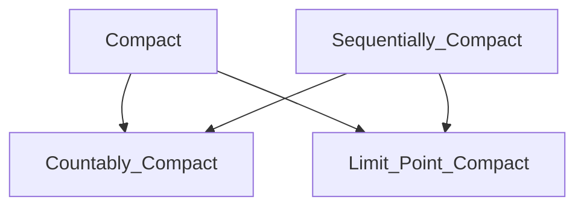

## 引言
在数学的广袤世界里，如何精确捕捉“有限”或“有界”这一直观概念？当我们从熟悉的[实数线](@article_id:308695)迈向更抽象的拓扑空间时，一个简单的想法演变成了多个既相似又不同的概念——紧致性、序列紧致性、[极限点紧致性](@article_id:315112)等。这些“紧致性”的变体在最普适的框架下并不等价，它们之间的微妙差别和深刻联系构成了泛函拓扑学中的一个核心议题。本文旨在厘清这一概念家族的内部结构，解决在不同拓扑背景下如何正确选用和理解这些性质的困惑。

为了系统地揭开这层面纱，我们将分三步展开探索。首先，在“原理与机制”一章中，我们将精确定义各种紧致性，并建立它们在一般拓扑空间中的普适层级关系，同时通过经典反例来理解它们为何不能相互替代。接着，在“应用与[交叉](@article_id:315017)联系”一章，我们将领略紧致性作为分析学、几何学乃至[数理逻辑](@article_id:301189)中的一个强大工具，如何保证解的存在性并揭示不同数学分支的内在统一。最后，通过“动手实践”环节，你将有机会亲自处理具体问题，从而在实践中巩固对这些抽象概念的理解。

## Principles and Mechanisms

想象一下你在海滩上，手里抓着一把沙子。这把沙子是“有限的”。你可以数清沙粒的数量（虽然很费劲），它们占据着你手掌中一块“有界”的区域，并且如果你把这把沙子扔到地上，沙粒无法无限地“逃逸”出去。在数学中，尤其是当我们从熟悉的数字线和三维空间迈向更为广袤的一般拓扑空间领域时，我们如何抓住这个关于“有限性”或“被包含性”的直观感觉呢？

事实证明，数学家们提出了几种不同的方式来捕捉这个概念，每一种都像从不同角度拍摄的同一座山峰的照片。这些不同的“紧致性”(compactness)概念在最广义的设定下并不相同，但它们之间的关系揭示了拓扑空间深层而优美的结构。让我们踏上这段旅程，从分离的概念开始，最终看到它们在一个熟悉的世界里奇迹般地合而为一。

### 有限性的多重面孔

在[实数线](@article_id:308695) $\mathbb{R}$ 上，一个闭合且有界的区间，比如 $[0, 1]$，是“紧致”这个概念的原型。它有什么特别之处呢？

1.  **覆盖特性 (Heine-Borel 定理)**: 无论你用多少个（可能是无穷多个）开放的小区间去“覆盖”它，你总能从中选出有限个小区间来完成同样的覆盖任务。
2.  **聚集特性 (Bolzano-Weierstrass 定理)**: 如果你从 $[0, 1]$ 中挑选出无穷多个点，那么这些点必然会在 $[0, 1]$ 内部的某个地方“聚集”起来。这个聚集点我们称之为**[极限点](@article_id:342484) (limit point)**。
3.  **序列特性 (Bolzano-Weierstrass 序列定理)**: 在 $[0, 1]$ 中任意挑选一个点组成的序列（比如 $1, \frac{1}{2}, \frac{1}{3}, \dots$），你总能找到一个[子序列](@article_id:308116)，它会收敛到 $[0, 1]$ 中的某一个点。

当数学家们试图将这些优美的性质推广到没有距离或坐标的更一般的“空间”时，他们发现这三个直观的想法分裂成了几个不同的、精确定义的属性：

-   **紧致性 (Compactness)**: 一个空间是紧致的，如果它的*每一个*开覆盖都有一个[有限子覆盖](@article_id:315465)。这是最强大、也是最重要的定义，直接推广了覆盖特性。
-   **[极限点紧致性](@article_id:315112) (Limit Point Compactness)**: 一个空间是极限点紧致的，如果它的*每一个*无限子集都有一个极限点。这捕捉了聚集特性。
-   **序列紧致性 (Sequential Compactness)**: 一个空间是序列紧致的，如果其中的*每一个*序列都有一个收敛的[子序列](@article_id:308116)。这推广了序列特性。
-   **[可数紧](@article_id:310342)致性 (Countable Compactness)**: 一个空间是[可数紧](@article_id:310342)致的，如果它的*每一个可数的*[开覆盖](@article_id:300466)都有一个[有限子覆盖](@article_id:315465)。这是对紧致性定义的一个自然弱化。

现在，我们舞台上的演员都已登场。游戏的目标是理解它们之间的等级关系和相互联系。

### 指挥链：普适的层级关系

在任何拓扑空间中，无论它多么奇特，都存在一个固定的“指挥链”。一些概念天生就比另一些更强。

首先，最直接的关系是 **紧致** 意味着 **[可数紧](@article_id:310342)致**。这几乎是根据定义得出的：如果*每个*[开覆盖](@article_id:300466)都有一个[有限子覆盖](@article_id:315465)，那么这个规则自然也适用于那些恰好是可数的[开覆盖](@article_id:300466) [@problem_id:1570961]。这就像说“所有鸟都会飞”必然意味着“所有乌鸦都会飞”一样。

接下来是一个更深刻的联系：**紧致** 意味着 **极限点紧致** [@problem_id:1571007]。这个论证非常巧妙，值得我们细细品味。想象一个空间，它有一个无限子集 $A$ 却没有任何极限点。这意味着什么？这意味着对于空间中的每一个点，我们都能找到一个开放的“安全气泡”将它包围，这个气泡最多只接触到 $A$ 中的一个点（如果这个点本身就在 $A$ 中）。所有这些气泡的集合自然覆盖了整个空间。现在，如果这个空间是紧致的，我们只需要有限个这样的气泡就能覆盖一切。但每个气泡最多只包含 $A$ 的一个点！这意味着 $A$ 只能是有限的，这与我们假设 $A$ 是无限的相矛盾。因此，紧致性就像一个宇宙法则，它不允许任何无限的集合“四处逃散”而不形成一个聚集点。

序列的世界也与覆盖和极限点的世界紧密相连。首先，**序列紧致** 意味着 **[极限点](@article_id:342484)紧致** [@problem_id:1570959]。这个道理很直观：如果你有一个[无限集](@article_id:297614)，就可以从中挑选出一个由不同点组成的无穷序列。序列紧致性保证了这个序列有一个收敛的[子序列](@article_id:308116)。这个子[序列的[极限](@article_id:355564)点](@article_id:342484)就像一块磁铁，吸引着序列中的点，因此它也自然成为了原始无限集的一个极限点。

更有趣的是，**序列紧致** 还意味着 **[可数紧](@article_id:310342)致** [@problem_id:1570997]。这个证明再次展现了反证法的美妙。假设一个空间是序列紧致的，但不是[可数紧](@article_id:310342)致的。这意味着存在一个可数的开覆盖 $\{U_n\}_{n=1}^\infty$ 没有[有限子覆盖](@article_id:315465)。这让我们可以构建一个“逃亡者”序列：我们可以挑选一个点 $x_1$ 不在 $U_1$ 里，一个点 $x_2$ 不在 $U_1 \cup U_2$ 里，以此类推，点 $x_n$ 不在前 $n$ 个[开集的并集](@article_id:312682)里。这个序列 $(x_n)$ 有什么行为模式？随着 $n$ 的增大， $x_n$ 从越来越多的覆盖集合中“逃离”。这样一个序列不可能有收敛的子序列。为什么？因为任何可能的[极限点](@article_id:342484) $p$ 都必须位于某个 $U_m$ 中。但根据我们的构造，当序列的下标足够大时，所有的点都在 $U_m$ 之外，它们无法向 $p$ 收敛。这与序列紧致性的假设相矛盾！

所以，我们建立了如下的普适层级：



### 当链条断裂：[反例](@article_id:309079)的艺术

你可能会问：这些箭头可以反过来吗？在一般的[拓扑空间](@article_id:315467)这个“狂野西部”，答案是——不行。理解为什么不行，比理解为什么行更能揭示这些概念的本质。这需要我们引入一些数学家们发现的“奇异动物园”里的神奇空间。

**[可数紧](@article_id:310342)致为何不等于紧致？**
一个经典的[反例](@article_id:309079)是[序数](@article_id:312988)空间 $[0, \omega_1)$，即所有可数[序数](@article_id:312988)构成的集合 [@problem_id:1570939]。你可以把它想象成一条线，但它“太长了”，以至于任何一个可数的点序列都无法抵达它的“尽头”。要覆盖整个空间，你需要一个由 $[0, \alpha)$ 形式的[开集](@article_id:303845)构成的*不可数*族，并且你永远无法从中只选出有限个来完成任务。因此，它不是紧致的。然而，可以证明，任何*可数*的[开覆盖](@article_id:300466)总有[有限子覆盖](@article_id:315465)，并且任何序列（一个可数的点列表）总能找到一个[极限点](@article_id:342484)（因为序列所有点的[上确界](@article_id:303346)仍然是一个可数[序数](@article_id:312988)，所以仍在该空间内）。所以，这个空间是序列紧致的，也是[可数紧](@article_id:310342)致的，但不是紧致的。这优雅地说明了“可数无穷”和“不可数无穷”之间的巨大鸿沟。

**极限点紧致为何不等于序列紧致？**
这个区别更加微妙。极限点紧致保证了任何无限集都会“聚集”，但这种聚集不一定能被一个*序列*捕捉到。考虑一个由不可数个 $\{0, 1\}$ 空间乘积构成的空间 $X = \{0, 1\}^I$ [@problem_id:1570959]。把它想象成一个有不可数多个开关的控制室，每个开关可以是开（1）或关（0）。一个序列只是在这个控制室里按可数次开关的路径。这个空间是紧致的（根据一个强大的定理，Tychonoff 定理），因此它也是[极限点](@article_id:342484)紧致的。但是，我们可以构造一个序列，它在每个坐标维度上的变化方式都不[同步](@article_id:339180)，以至于没有任何[子序列](@article_id:308116)能在所有维度上同时稳定下来。就像一只试图同时踏入不可数条河流的虫子，它永远无法稳定地停在某处。这个例子告诉我们，当空间的“维度”或“复杂度”是不可数的时候，一个可数的序列可能不足以“探索”其所有的聚集行为。

### 重建秩序：公理的力量

那么，这个概念家族注定要永远分裂下去吗？不。如果我们对空间施加一些温和的“文明规则”，即所谓的**[分离公理](@article_id:309610) (separation axioms)** 和 **[可数性公理](@article_id:312820) (countability axioms)**，秩序就会开始恢复。

一个非常基本的要求是 **T1 公理**。它只要求对于任意两个不同的点，我们都能找到一个邻域包含其中一个而不包含另一个。这相当于说，空间中的单个点是[闭集](@article_id:296900)。在这个相当温和的假设下，**[极限点紧致性](@article_id:315112)**和**[可数紧](@article_id:310342)致性**就变得等价了 [@problem_id:1570989]。这个小小的规则足以弥合证明中的一个漏洞，让这两个概念统一起来。

一个更强的规则是 **第一[可数性公理](@article_id:312820) (first-countability axiom)**。它要求每个点都有一个可数的“[局部基](@article_id:311988)”，也就是说，在每个点周围，我们可以找到一个由小到大、可数的邻域序列，它们可以像一把尺子一样精确地“测量”到这个点的收敛性。我们熟悉的[度量空间](@article_id:299308)（如 $\mathbb{R}^n$）都满足这个性质。这个公理是赋予序列力量的关键。在[第一可数空间](@article_id:308726)中，关于邻域的局部性质都可以转化为关于序列的性质。因此，它使得**[可数紧](@article_id:310342)致性**和**序列紧致性**成为等价的 [@problem_id:1570951] [@problem_id:1570981]。

加上这些公理后，我们的层级图变得更加紧密和有序。在第一可数的 T1 空间中，[极限点](@article_id:342484)紧致、[可数紧](@article_id:310342)致和序列紧致这三者合而为一了！

### 回到原点：[度量空间](@article_id:299308)的优雅

现在，让我们回到我们最熟悉的家园：**[度量空间](@article_id:299308) (metric spaces)**，即那些拥有“距离”函数的空间。

[度量空间](@article_id:299308)自然满足 T1 公理和第一[可数性公理](@article_id:312820)。因此，我们刚刚建立的所有[等价关系](@article_id:298723)都成立。但更美妙的事情发生了。在度量空间中，所有四种紧致性概念——紧致、序列紧致、[可数紧](@article_id:310342)致、[极限点](@article_id:342484)紧致——都奇迹般地统一了！[@problem_id:1570944]

```mermaid
graph TD
    subgraph "任意[拓扑空间](@article_id:315467)"
        A[紧致] --> B[[可数紧](@article_id:310342)致]
        A --> C[[极限点](@article_id:342484)紧致]
        D[序列紧致] --> B
        D --> C
    end
    subgraph "度量空间 (Metric Space)"
        E[紧致]
        F[序列紧致]
        G[[可数紧](@article_id:310342)致]
        H[[极限点](@article_id:342484)紧致]
        E <--> F
        F <--> G
        G <--> H
    end
```

这个大统一的关键是什么？一个叫做**完全有界性 (total boundedness)** 的属性 [@problem_id:1570944]。一个度量空间是完全有界的，如果对于任何给定的正数 $\epsilon$，我们都可以用有限个半径为 $\epsilon$ 的小球覆盖整个空间。可以证明，序列紧致性强制一个度量空间必须是完全有界的。而“[完全有界](@article_id:297177)”加上“完备性”（每个柯西序列都收敛），就等价于紧致性。正是这个通过距离才得以定义的“完全有界性”，成为了连接所有概念的最后一块拼图。

所以，我们最初的困惑——为什么“有限性”有这么多张面孔？——源于我们在广义拓扑空间的无垠荒野中的探索。当我们回到拥有良好结构的度量空间时，覆盖、聚集和[序列收敛](@article_id:304012)这三种不同的视角，最终都汇合成了一个单一、统一而深刻的概念。这段旅程是值得的，因为它让我们真正理解了“紧致性”的内涵，以及为什么它在数学分析中如此强大和无处不在。我们从一个简单的想法出发，经历了一系列分化和辨析，最终回归到一个更高层次的统一。这，就是数学的美。